# Adobe After Effects

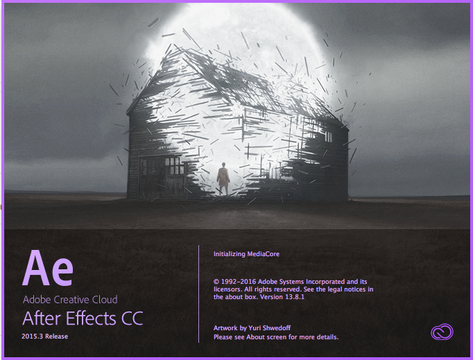

This is a basic introduction to get up and running using Adobe After Affects CC

## Workspace

## Import Images & Movies

File > Import >

or double click the Project Panel

or Drag and Drop from open folder or desktop to Project Panel

Asset is now in Project Panel. Note it displays info such as size and colour

## Create a Composition

You need to create a composition as a container elements for your Motion graphics:

Composition > New Composition

Set the Composition Setting to the required Output

or Drag Drop from folder or desktop to import asset to the New Composition at the bottom of the Project Panel

Adjust Composition Setting at anytime:

Composition > Composition Setting >
 

## Import a PhotoShop Files as a (Layered) Composition

Import Photoshop File as explained above

There is an option top Merge Layer Styles.

Make sure you change Import Kind to: Composition - Retain Layer Sizes, if you do not do this each Layer item willl have a large transparent area of the same size as the composition.

PSD file now imported - note a Composition has been created and the Layers are in a Folder
 

## Add Asset from Project Panel to composition window

## Add Asset from Project Panel to a Timeline location

Then scale item with selection tool

or press S on keyboard and use drag over the Scale percentage values in timeline.

## Timeline Layer Structure
Add 3 shapes to Composition. Make sure you do not have shape selected before adding new shape as it will be placed on the selected layer not a new one.

Add a colour label, change their time length and show/hide layer

## Layer Time Stretch
 You can increase or decrease the length of a layer block:
 
 Layer > Time > Time Stretch
 
 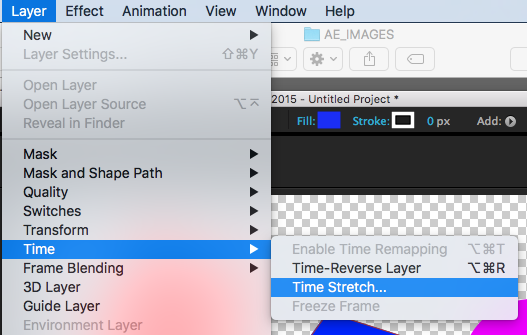
 
 Then adjust the time in the dialogue box
 
 
 
## Anchor Point
Move the item point on an object - Select Anchor Tool from the Tool Bar 

and drag the Centre Point on the Object.

## Animate - Move
Create a shape and make it 10secs in the Timeline - either Drag it with the mouse or Stretch Time as above.

 
 
You might need to move centre point to the centre of the shape as above. Do this BEFORE YOU ADD KEYFRAMES
 
Press P on the Keyboard to bring up Positioning in the Timeline.
 

Add Keyframe by clicking on the Stop Watch icon

 
 
Move Playback head to where you want the movement to stop.

You might need to move centre point to the centre of the shape as above.

X & Y 

## Change Rendering Options
Lower the Rendering to either a Third or Half to speed After Effects up and change to Full to see a full quality preview.

## Adding Solid (Colour Filled Layers)
Right Mouse in Project Panel Import > Solid

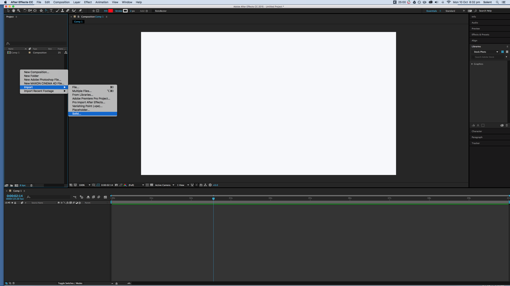

Adjust settings in the Solid dialogue panel and click OK

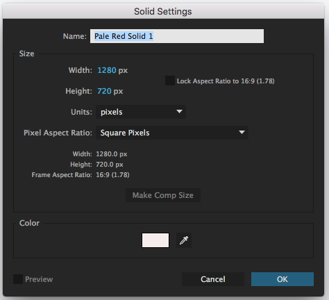

Solid will appear in Project Panel - Drag and Drop to your Composition

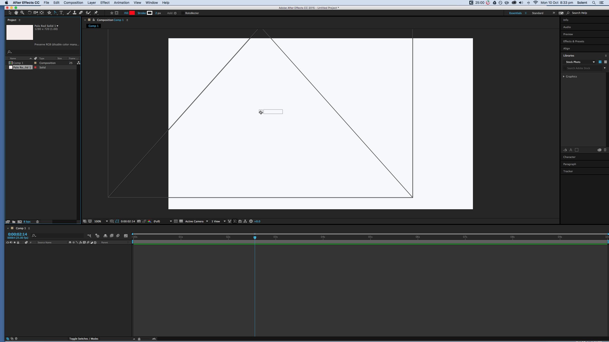

You can open the solid dialogue panel from the layer menu to edit it

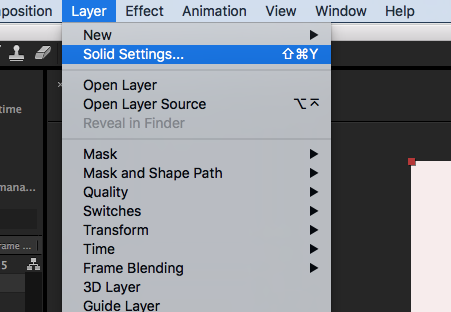

## Correct Curved Path Between Keyframes

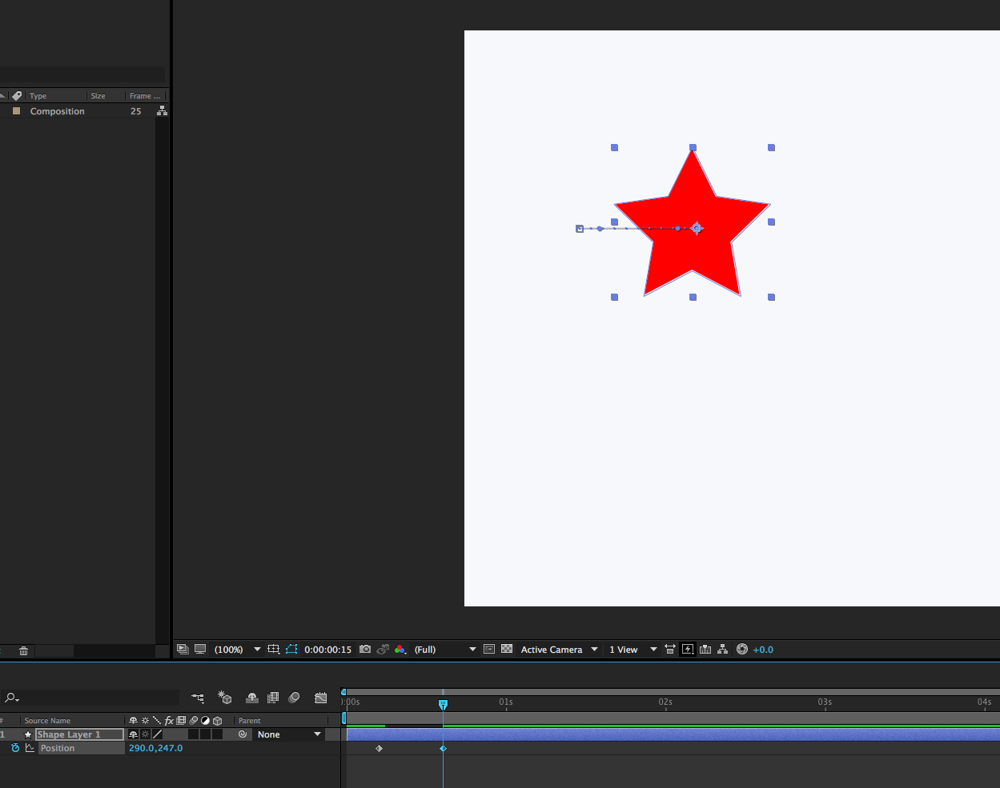

You might find that after you have made an initial straight motion path (above) between keyframes the next keyframe will have a curved path (below)

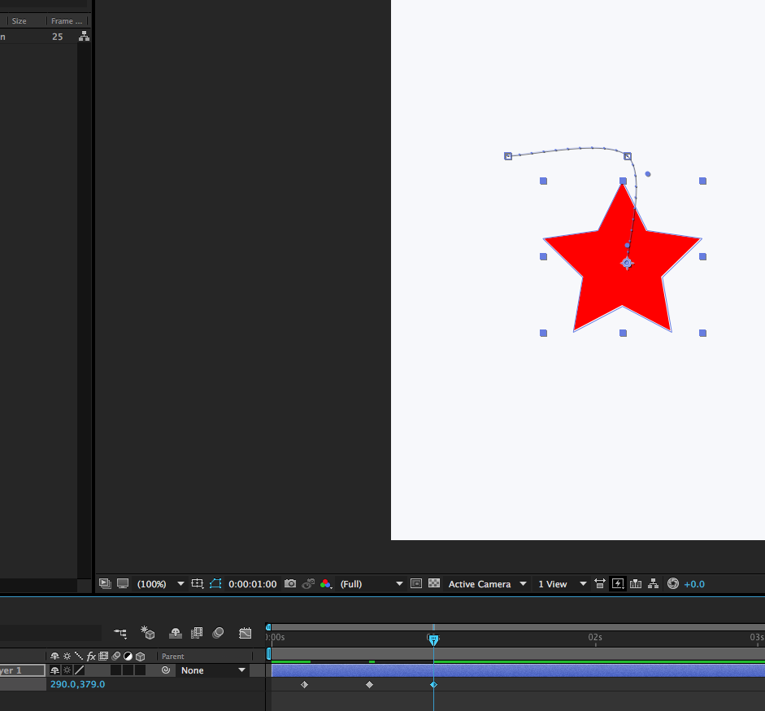

Select the Convert Vertex Tool From the Pen Tools 

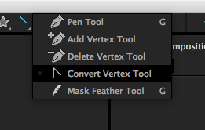

and click the path to convert to a straight path.

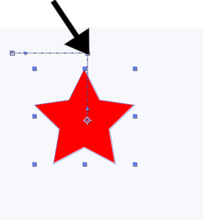

## Object Following the Path (Banking)

To create more realistic path follow use the Auto-Orient from the layer menu.

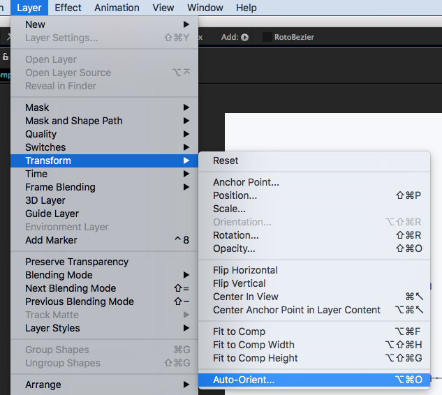

## Add and Edit Sound
Just drag and drop a sound file either MP3 or WAV onto the Project Panel then drag and drop onto the timeline. You can crop sound in the timeline by using keyboard short cut:  **Command Shift D** (APPLE MAC) or **Control Shift D** (WINDOWS), but Ideally it is best to edit sound to the right length before you bring it into After Affects. 

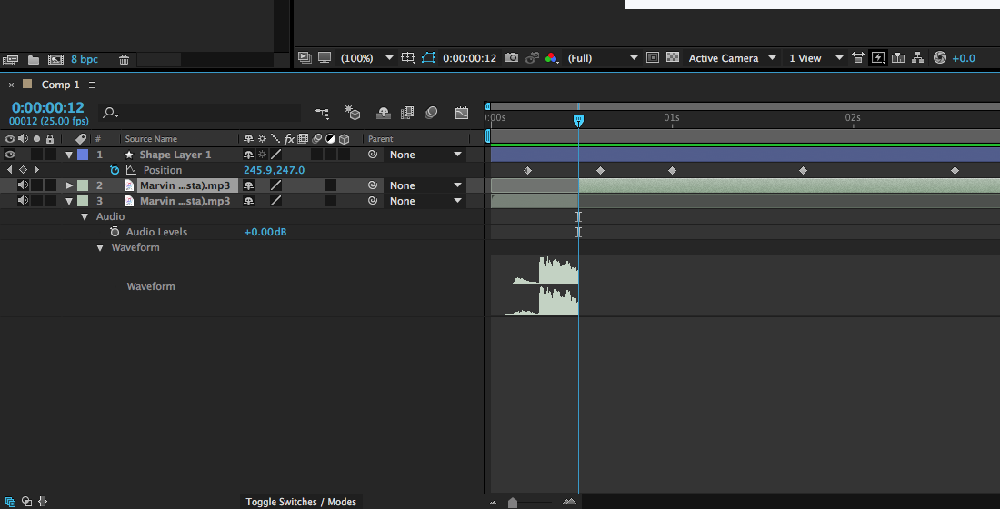
